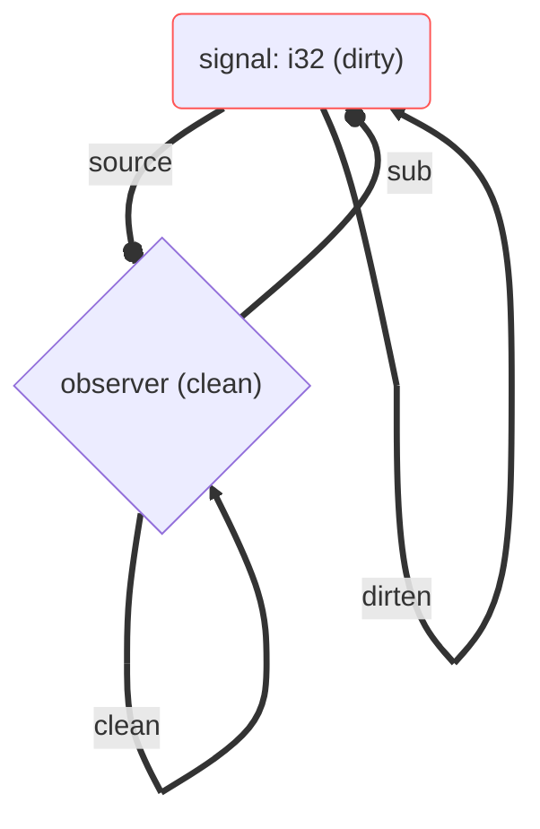

```mermaid
graph TD
signal4294967297("signal: i32 (dirty)")

observer4294967299 == sub ==o signal4294967297
observer4294967299{"observer (clean)"}


signal4294967297 == source ==o observer4294967299


observer4294967299 == clean ==> observer4294967299


signal4294967297 == dirten ==> signal4294967297

style signal4294967297 stroke:#f55
```